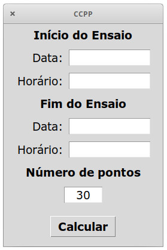
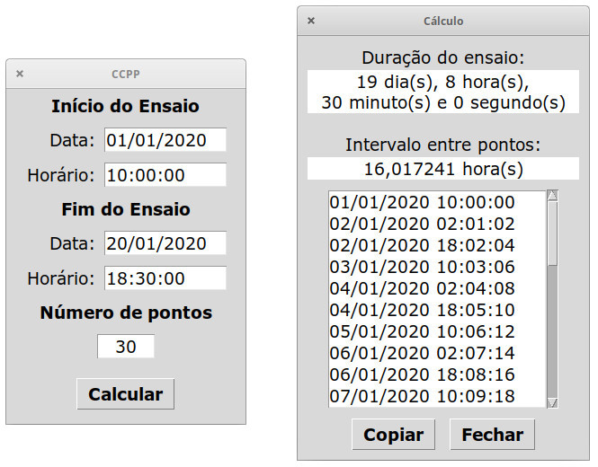

# CCPP
Creep Curve Points Projection

*Projeção de Pontos para a Curva de Fluência*

## Descrição

Programa simples desenvolvido para o facilitar a construção da curva de fluência. O usuário informa o início, o fim do ensaio e a quantidade de pontos da curva, então calcula-se o tempo total do ensaio, o intervalo entre cada ponto e são mostrados as datas e horários para se inserir na planilha dos dados de fluência.

## Capturas de tela





## Dependências

* Python3
* Tkinter (interface gráfica em Python)

### Instalação do python no Windows

Baixar e instalar o Python3 [direto do site oficial](https://www.python.org/) (tkinter já incluso).

### Instalação do python em distribuições Linux

O Python3 vem instalado por padrão na maioria das distribuições Linux, porém é necessário instalar o tkinter. Em algumas distribuições basta procurar `tkinter` na loja de aplicativos. Caso prefira usar o terminal, segue os comandos de instalação.

Para Ubuntu e derivados:
```
sudo apt install python3-tk
```

Para o Fedora:
```
sudo dnf install python3-tkinter
```

Para o Archlinux:
```
sudo pacman -S tk
```

## Execução do aplicativo CCPP

### Execução no Windows

* Baixar o arquivo `ccpp.py`.
* Renomar para `ccpp.pyw`.
* Clicar duas vezes sobre `ccpp.pyw`.

### Execução em distribuições Linux

Baixar o arquivo `ccpp.py` e executá-lo. Você pode fazê-lo pela interface gráfica ou pelo terminal. Caso prefira usar o terminal, segue os comandos:

```
git clone https://github.com/filipestevao/CCPP.git
cd CCPP
chmod +x ccpp.py
./ccpp.py
```
